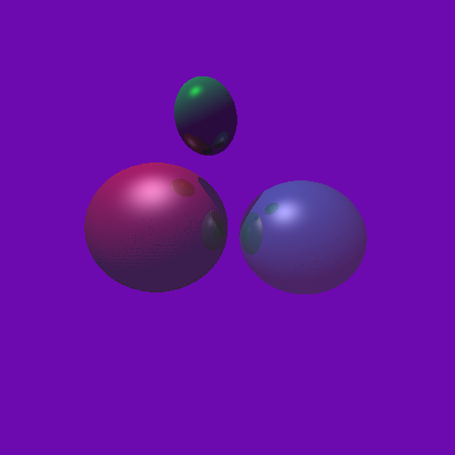
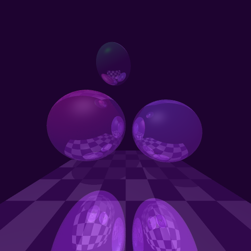
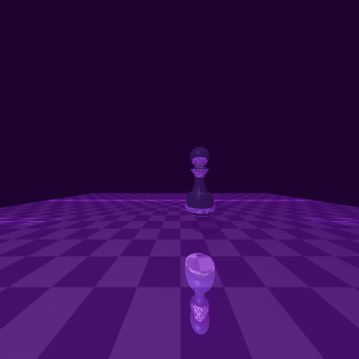
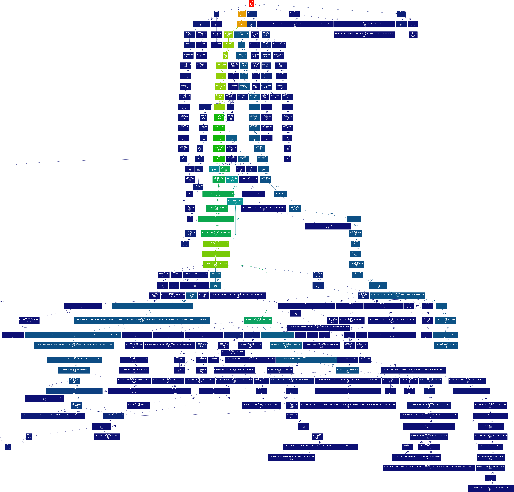

# Ray Tracer

Assignment 3 for *Intros to CG*

Based on "Skeleton Code" (the first submit 73aa6c449734ae26ad8a92af5e2c7d49fa88f15b).

***Author: Danyang Song (Arthur)***

*More details on completing this project, see https://github.com/GreysTone/SFU-CMPT-000-ASGN-2.*

***All steps (all functions) are implemented in the assignment, extra information are shown as below.***

***Bonus Completed***

******

## Compile, Deploy & OS Environment
* Linux (**tested on Ubuntu 14.04.03 LTS in VMware 8**)
    * Dependency: glew, freeglut3, mesa (possibly others needed)
    * In an initial environment
        * make && ./raycast [-u | -d | bonus | fbonus] step_max
    * Otherwise
        * make clean
        * make && ./raycast [-u | -d | bonus | fbonus] step_max <options>

## Preview
* Default Scene (./raycast -d 5)

  

* All Options Scene (./raycast -u 5 +s +l +r +f +c +p)

  

* Bonus(Accelerated) Scene (./raycast fbonus 5)

  

## Acceleration in Bonus Implementation
* Speed compare (option 'bonus 5' & 'fbonus 5')
  * without any accelerations: **more than 1 hour**
  * active all accelerations: **less than 1.5 minute**

* **Parallel programming** with *OpenMP*
* **Object Boundary Box** accelerations
* A simple **OctTree** implementation
* **Object Internal** intersection in refraction

## Features
* ***Parallel*** (with **'-fopenmp'** compile option)
* ***Object Boundary Box***
* Simmple ***OctTree***
* ***STL*** in C++11 (with **'-std'** compile option)
* Using **Normal Distribution** in stochastic diffuse
* **'-g'** compile option for debugging
* **'-pg'** compile option for profiling

## Options Description
* render bonus part using:
      ./raycast bonus step_max      # normal bonus rendering
      ./raycast fbonus step_max     # active all accelerations
* Since I open the parallel features, the statistic number of intersection is ignored, while there is also an approximate number in **profiling report** (shown as below).
* **'bonus'** or **'fbonus'** will automatically tigger *shadow*, *refraction*, *recursive reflection*, *chessboard*, *stochastic diffuse* and *antialias*

## Profiling
* Valgrind(**callgrind.out.[id]**) & gprof(**gmon.out**)
* Report for without any accelerations:

## MACRO Description
* global.h
  * **OCT_OUTPUT**, showing OctTree's basic information
  * **OCT_REDUCE_MEM**, reducing the cost of memory of building OctTree
  * **SHOW_PROGRESS**, showing the progress on different threads
  * **GT_PARALLEL**, enabling parallel features

## Some Comments
* Parallel computation is not balanced, due to different scene data
* Only implement OctTree for 1 level, but it still accelerates a lot
